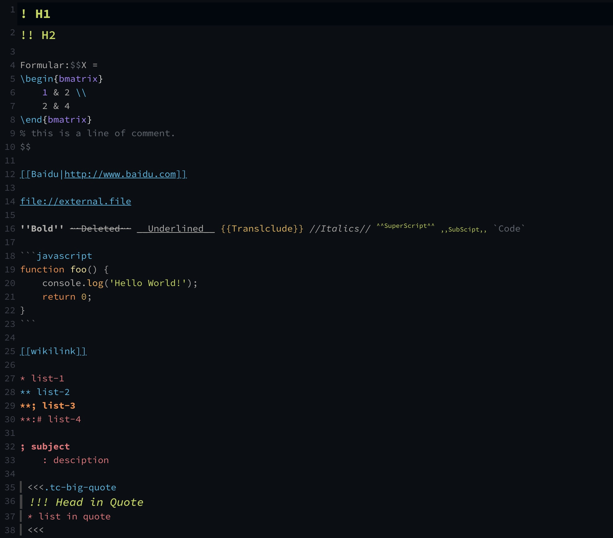
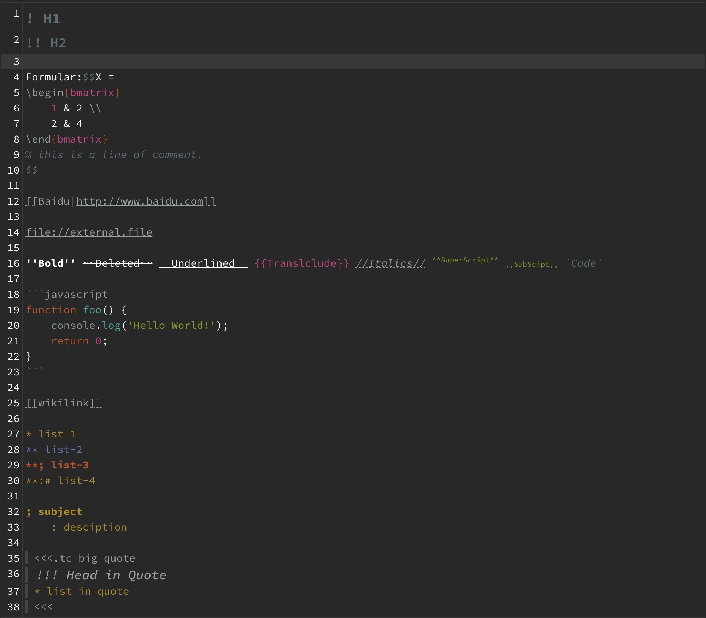

# CodeMirror-Mode-TiddlyWiki5

Adds Syntax Highlighting for TiddlyWiki tiddlers (text/vnd.tiddlywiki) to the CodeMirror.

## 插件说明

增加 [CodeMirror](http://codemirror.net) 对TiddlyWiki5语法高亮的支持，所有类型留空或者为`text/vnd.tiddlywiki`的tiddler都会有高亮。请首先安装最新版CodeMirror主插件和CodeMirror XML子插件(不然会报错)。

插件还在开发中，如有任何建议或者bug请直接提Issue。

如果插件报错了，不必惊慌，因为插件不会对TiddlyWiki本体内容做修改，所以只需要卸载就能够消除问题，但保险起见**还是建议先备份再安装**。

## 开发感想

在使用TiddlyWiki之后，一直苦于TiddlyWiki5语法没有高亮支持，写作体验不是很好。之前有也在网上找到一些相关的解决办法，例如在[Google Group](https://groups.google.com/g/tiddlywiki/c/c3y-PycRP4M)上面有人建议[用TiddlyWiki2的语法进行Hack](https://www.gitmemory.com/issue/Jermolene/TiddlyWiki5/3685/770313436)。

也有人编写了一个可用的CodeMirror的扩展版本[TW5-CodeMirror-Plus](https://github.com/adithya-badidey/TW5-codemirror-plus)，虽然是可用的，但是有两个问题：一个是语法高亮的内容有限，另一个是该插件直接基于theme而非mode进行开发，这就导致''如果想要用TW5的高亮就必须舍弃其他语法高亮，并且无法自定义主题''。所以最终还是打算自己写一个XD

本插件其实也是基于[TW5-CodeMirror-Plus](https://github.com/adithya-badidey/TW5-codemirror-plus)开发的，只不过魔改了很多，基本上是两个插件了。

## TODO

- [x] 代码块内的语法高亮与缩进。
- [x] LaTeX公式高亮与缩进。
- [ ] 自动补全内部链接的tiddler名称。
- [ ] 其他代码提示。
- [ ] 代码错误检查。
- [ ] 鼠标悬在LaTeX代码上方能够进行公式预览。
