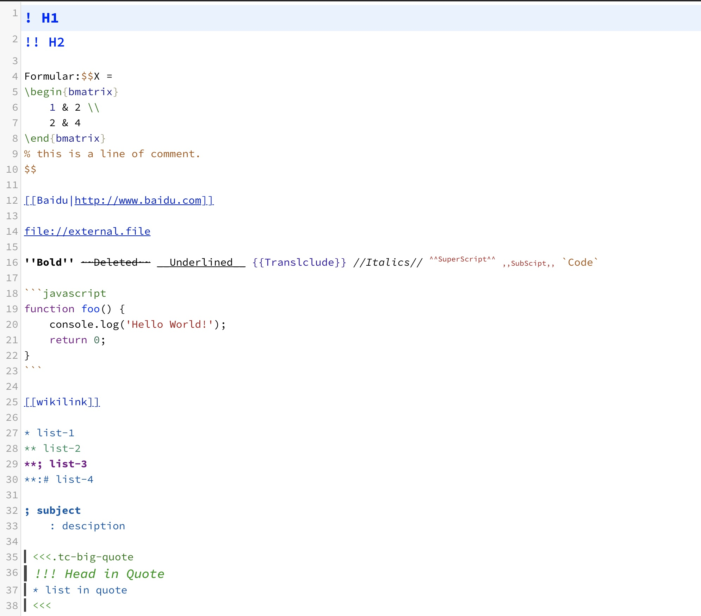
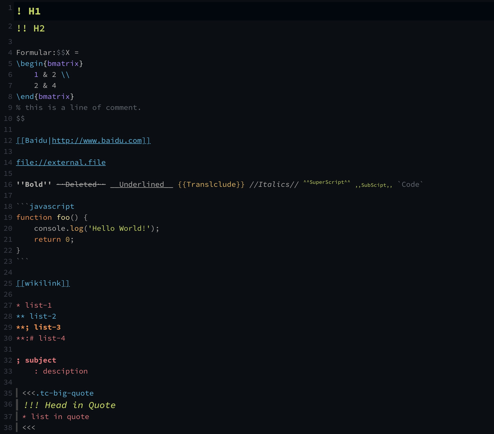
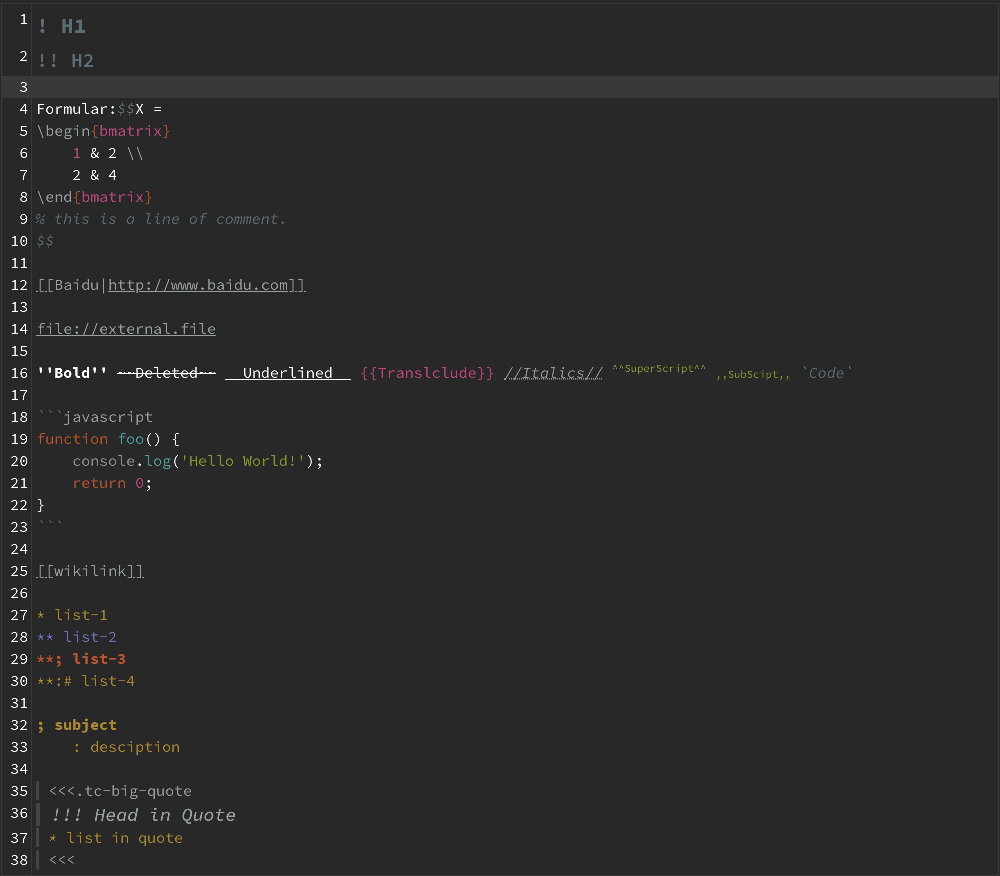
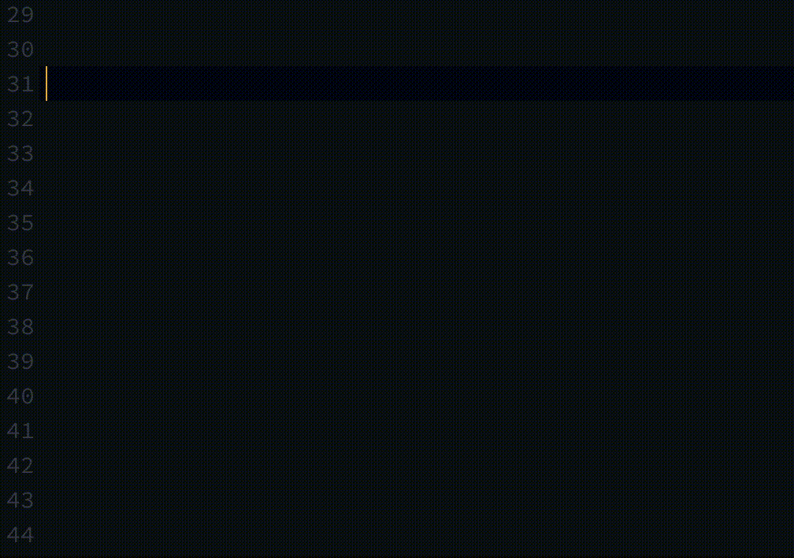
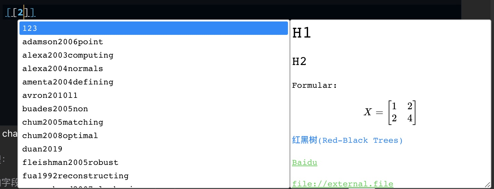
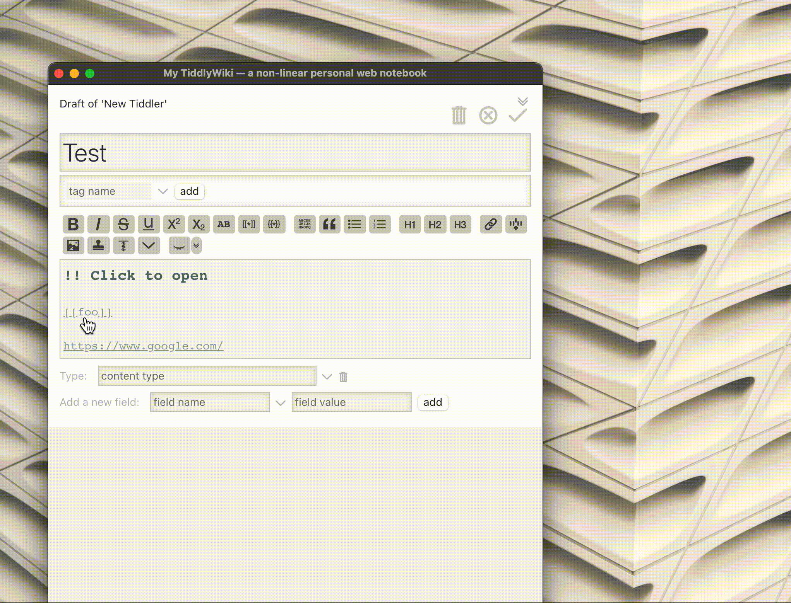

# CodeMirror-Mode-TiddlyWiki5

Adds Syntax Highlighting for TiddlyWiki5 tiddlers (`text/vnd.tiddlywiki`) to the CodeMirror, along with some other useful editor addon (wikilink hint, macro hint, etc.). Now is under development.

为 TiddlyWiki 的 CodeMirror 编辑器添加 TiddlyWiki5(`text/vnd.tiddlywiki`)语法高亮，同时还有其他有用的编辑器扩展(如 Wiki 链接自动提示、宏提示等)，以及可以打开的链接。现在正在开发中。

[> English Readme <](https://github.com/Gk0Wk/CodeMirror-Mode-TiddlyWiki5/blob/main/README_en.md)

---

## 插件说明

增加 [CodeMirror](http://codemirror.net) 对 TiddlyWiki5 语法高亮的支持，所有 MIME 类型留空或者为`text/vnd.tiddlywiki`的 tiddler 都会有高亮。同时支持像`VSCode`那样在打字时实时进行代码补全提示+预览(目前仅实现了 WikiLink 补全)，且**不需要**用<kbd>Ctrl</kbd>+<kbd>Space</kbd>激活。

插件还在开发中，如有任何建议或者 bug 请直接提 Issue。

## 安装&编译

请首先安装最新版`CodeMirror`主插件和`CodeMirror Autocomplete`子插件(不然会报错)。

直接去[Release](https://github.com/Gk0Wk/CodeMirror-Mode-TiddlyWiki5/releases)下载`CodeMirrorModeTiddlyWiki5-X.X.X.json`，然后将其拖拽到你的 TiddlyWiki 中，或者在 TiddlyWiki 中导入之。

如果插件报错了，不必惊慌，因为插件不会对 TiddlyWiki 本体内容做修改，所以只需要卸载就能够消除问题，但保险起见**还是建议先备份再安装**。

如果想 DIY 和编译，请直接运行`make`或者`make build`。请注意，被打包的是那几个`xxx.min.js`和`xxx.min.css`。

## 功能介绍

高亮TiddlyWiki5语法，支持内嵌代码块和LaTeX的语法高亮

Default:

Ayu-Dark:

TiddlyWiki:

注意：这些主题有些是我自己装的，如感兴趣换主题，请阅读 TiddlyWiki 的 CodeMirror 的 README。

WikiLink实时补全提示+预览

在预览打开的情况下：

可点击的链接

- 对于 macOS 用户，<kbd>cmd</kbd> + <kbd>鼠标左键</kbd> 可以打开 tiddler 或者外部 url。
- 对于非 macOS 用户，<kbd>ctrl</kbd> + <kbd>鼠标左键</kbd> 可以打开 tiddler 或者外部 url。

其他功能正在开发中。

## 开发感想

在使用 TiddlyWiki 之后，一直苦于 TiddlyWiki5 语法没有高亮支持，写作体验不是很好。之前有也在网上找到一些相关的解决办法，例如在[Google Group](https://groups.google.com/g/tiddlywiki/c/c3y-PycRP4M)上面有人建议[用 TiddlyWiki2 的语法进行 Hack](https://www.gitmemory.com/issue/Jermolene/TiddlyWiki5/3685/770313436)，但是这种方法并不完美。

也有人编写了一个可用的 CodeMirror 的扩展版本[TW5-CodeMirror-Plus](https://github.com/adithya-badidey/TW5-codemirror-plus)，虽然是可用的，但是有两个问题：一个是语法高亮的内容有限，另一个是该插件直接基于 theme 而非 mode 进行开发，这就导致**如果想要用 TW5 的高亮就必须舍弃其他语法高亮，并且无法自定义主题**。所以最终还是打算自己写一个 :D

本插件一开始也是基于[TW5-CodeMirror-Plus](https://github.com/adithya-badidey/TW5-codemirror-plus)开发的，只不过魔改了很多，现在基本上是两个不同的插件了。

## TODO List

- [x] 代码块内的语法高亮与缩进。
- [x] LaTeX 公式高亮与缩进。
- [x] 自动补全内部链接的 tiddler 名称。
- [x] 可点击的URL与WikiLink。
- [x] 补全提示的预览框。
- [ ] 其他代码提示。
- [ ] 代码错误检查。
- [ ] 鼠标悬在 LaTeX 代码上方能够进行公式预览。
