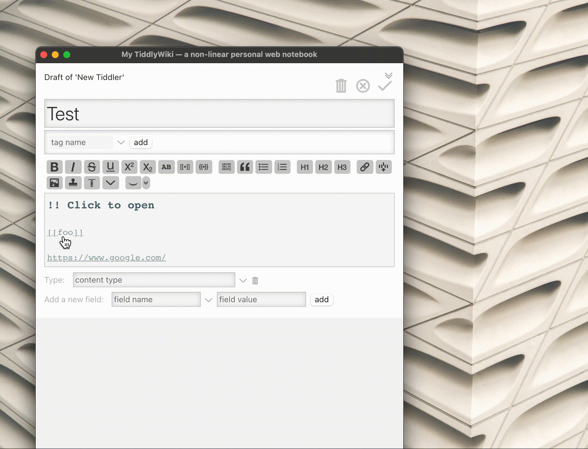

# CodeMirror-Mode-TiddlyWiki5

[示例 | demo](https://gk0wk.github.io/TW5-CodeMirror-Enhanced/)

Implement a swift and rich extension framework for TiddlyWiki5's CodeMirror editor, including TiddlyWiki5 (`text/vnd.tiddlywiki`) syntax highlighting, Wiki link auto-completion, clickable links, Tiddler preview, and more. More features ( syntax tree, syntax completion , WYSIWYG mode , quick template input , etc. ) is under development . This framework is open source framework , anyone is welcome to join the development , the documentation is being written .

[> 中文 README <](https://github.com/Gk0Wk/TW5-CodeMirror-Enhanced/blob/main/README.md)

---

## Description

This plugin provides an easy-to-extend framework for TiddlyWiki5's CodeMirror editor. The original project [CodeMirror-Mode-TiddlyWiki5](https://github.com/Gk0Wk/CodeMirror-Mode-TiddlyWiki5) has stopped being developed. This framework inherits all the features of the original project and refactors the entire framework into an extensible modular CodeMirror framework. Currently supported features are:

- Support for TiddlyWiki5 syntax highlighting, all MIME types left blank or for `text/vnd.tiddlywiki` tiddler will be highlighted (see below for the effect).
- Support for real-time code completion while typing like the mainstream IDE (**no need** to activate with <kbd>Ctrl</kbd>+<kbd>Space</kbd>), with completion of TiddlyWiki5-related content, and rich extension capabilities that can be customised to extend.
  - Currently supports tiddler name completion when typing WikiLink, as well as a preview of the tiddler content (see below for effects).
- Clicking on a url or WikiLink will open/jump to the corresponding page/tiddler (see below), which can be custom extended.

The framework is open to anyone who wants to optimize the core or submit their own plugins. Future plans can be found in the `TODO List` section below.

## Installation & Compilation

### Installation

<span style="color: red; font-weight: 900;">First install the latest version of `CodeMirror` main plugin and `CodeMirror Autocomplete` sub-plugin (otherwise it will report an error).</span>

If you are a single file TiddlyWiki5 user or a `NodeJS` version TiddlyWiki5 user, go directly to [Release](https://github.com/Gk0Wk/CodeMirror-Mode-TiddlyWiki5/releases) and download `TW5-CodeMirror-Enhanced-X.X.X.json` and drag and drop it into your TiddlyWiki, or import it in TiddlyWiki.

If the plugin reports an error, there is no need to panic, as the plugin does not make changes to the TiddlyWiki proper content, so simply uninstalling it will eliminate the problem, but to be on the safe side **it is still recommended to backup it before installing it**.

If you are using the `NodeJS` version of the TiddlyWiki5 project and wish to install the plugin into the project, you can download the `TW5-CodeMirror-Enhanced-X.X.X.zip` file, unzip it, place it in the `plugins` folder of your project, and use the plugin in the `tiddlywiki.info` file.

### Compilation

> Since the current project involves the compilation and packaging of TypeScript subprojects, the compilation steps are tedious, if you have a better solution, welcome your suggestions!

First install `python3`, `node` and `npm`, and install some necessary packages in the project root directory (same for yarn):

``shell
npm install
```

Then do the compilation:

```shell
npm run build
```

## Function Introduction

<details>
<summary>TiddlyWiki5 syntax highlighting, support for inline code blocks and syntax highlighting for LaTeX</summary>

Default:


Ayu-Dark:


TiddlyWiki:


</details>

Note: Some of these themes are installed by myself, if you are interested in changing the theme, please read TiddlyWiki's CodeMirror's README.

<details>
<summary>WikiLink Realtime Hint+Preview</summary>


With hint-preview opened：


</details>

<details>
<summary>Clickable links</summary>



- For macOS users，<kbd>cmd</kbd> + <kbd>LeftClick</kbd> to open tiddler or external url.
- For other users，<kbd>ctrl</kbd> + <kbd>LeftClick</kbd> to open tiddler or external url.

</details>

Other features are under development.

## Developer

[Wiki(Not finished)](https://github.com/Gk0Wk/TW5-CodeMirror-Enhanced/wiki)

## Thoughts & Thanks to

After using TiddlyWiki, I've been suffering from the lack of highlighting support in TiddlyWiki5 syntax, and the writing experience is not very good. I have found some solutions on the web, for example, on the [Google Group](https://groups.google.com/g/tiddlywiki/c/c3y-PycRP4M) someone suggested [Hack with TiddlyWiki2 syntax](https://www.gitmemory.com/issue/Jermolene/TiddlyWiki5/3685/770313436), but this approach is not perfect.

An extended version of CodeMirror has also been written that is available [TW5-CodeMirror-Plus](https://github.com/adithya-badidey/TW5-codemirror-plus), which is available but has two problems. One is that the syntax highlighting is limited. The other is that the plugin is developed directly based on theme rather than mode, which leads to that **if you want to use TW5's highlighting you have to discard other syntax highlighting and can't customize the theme**. So eventually I plan to write one myself :D

This plugin is also based on [TW5-CodeMirror-Plus](https://github.com/adithya-badidey/TW5-codemirror-plus) at the beginning of the development, but the magic changed a lot, now it is basically two different plug-ins, I would like to thank [TW5-CodeMirror-Plus](https://github.com/adithya-badidey/TW5-codemirror-plus) author [adithya-badidey](https://github.com/adithya-badidey/TW5-codemirror-plus). CodeMirror-Plus](https://github.com/adithya-badidey/TW5-codemirror-plus) by [adithya-badidey](https://github.com/adithya-badidey), the author of and [PMario](https://github.com/pmario), the original author of `src/mode/tiddlywiki5.js`!

## TODO List

- [x] Syntax highlighting and indentation within code blocks.
- [x] LaTeX formula highlighting and indentation.
- [x] Auto-completion of tiddler names for internal links.
- [x] Clickable URLs and WikiLink.
- [x] Preview box for completing hints.
- [ ] Write API documentation.
- [ ] Rewrite the TiddlyWiki5 syntax parser using `Lezer`.
- [ ] Rewrite syntax highlighting and indentation using the rewritten syntax parser.
- [ ] Other code hints.
- [ ] Code error checking.
- [ ] Mouse over LaTeX code for formula preview.
- [ ] WYSIWYG editor.
