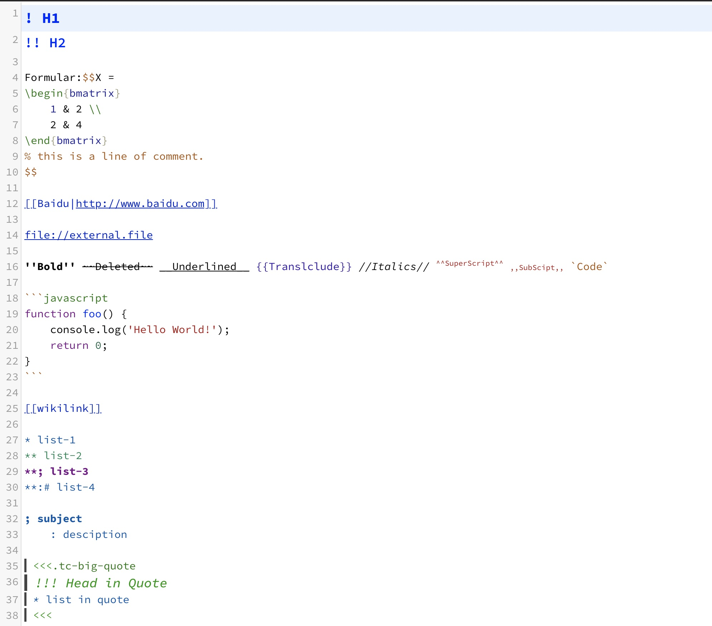
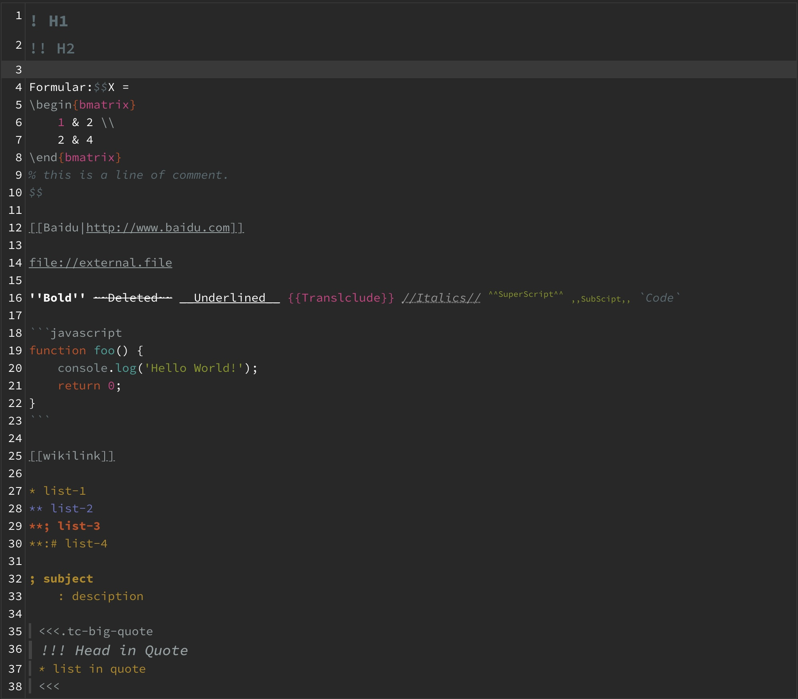

# CodeMirror-Mode-TiddlyWiki5

Adds Syntax Highlighting for TiddlyWiki5 tiddlers (`text/vnd.tiddlywiki`) to the CodeMirror, along with some other useful editor addon (wikilink hint, macro hint, etc.), and clickable links. Now is under development.

[> 中文 README <](https://github.com/Gk0Wk/CodeMirror-Mode-TiddlyWiki5/blob/main/README.md)

---

## Plugin description

Add [CodeMirror](http://codemirror.net) support for TiddlyWiki5 syntax highlighting, all tiddlers with MIME type left blank or `text/vnd.tiddlywiki` will be highlighted. Also supports real-time code completion hints like `VSCode` while typing (currently only WikiLink completion is implemented) and **no need** to activate with `Ctrl+Space`.

Plugin is still under development, if you have any suggestions or bugs, please directly mention Issues.

## Installation & Compilation

First install the latest version of `CodeMirror` main plugin and `CodeMirror Autocomplete` sub-plugin (otherwise it will report an error).

Go directly to [Release](https://github.com/Gk0Wk/CodeMirror-Mode-TiddlyWiki5/releases) and download `CodeMirrorModeTiddlyWiki5-X.X.X.json`, then drag and drop it into your TiddlyWiki, or import it in TiddlyWiki.

If the plugin reports an error, there is no need to panic, because the plugin does not make changes to your TiddlyWiki content, so just uninstall it and you will be able to eliminate the problem, but to be on the safe side **it is still recommended to backup it before installing it**.

If you want to DIY and compile, please run `make` or `make build` directly. Note that it is the `xxx.min.js` and `xxx.min.css` that are packaged.

## Function Introduction

TiddlyWiki5 syntax highlighting, support for inline code blocks and syntax highlighting for LaTeX

Default:

Ayu-Dark:

TiddlyWiki:

Note: Some of these themes are installed by myself, if you are interested in changing the theme, please read TiddlyWiki's CodeMirror's README.

WikiLink Auto Hint

Clickable links

- For macOS users，`cmd` + `LeftClick` to open tiddler or external url.
- For other users，`ctrl` + `LeftClick` to open tiddler or external url.

Other features are under development.

## Development Thoughts

After using TiddlyWiki, I've been suffering from the lack of highlighting support in TiddlyWiki5 syntax, and the writing experience is not very good. I have found some solutions on the web, for example, on the [Google Group](https://groups.google.com/g/tiddlywiki/c/c3y-PycRP4M) someone suggested [Hack with TiddlyWiki2 syntax](https://www.gitmemory.com/issue/Jermolene/TiddlyWiki5/3685/770313436), but this approach is not perfect.

An extended version of CodeMirror has also been written that is available [TW5-CodeMirror-Plus](https://github.com/adithya-badidey/TW5-codemirror-plus), which is available but has two problems. One is that the syntax highlighting is limited. The other is that the plugin is developed directly based on theme rather than mode, which leads to that **if you want to use TW5's highlighting you have to discard other syntax highlighting and can't customize the theme**. So eventually I plan to write one myself :D

This plugin is also based on [TW5-CodeMirror-Plus](https://github.com/adithya-badidey/TW5-codemirror-plus) at the beginning, but I made a lot of changes on it, now they're basically two different plugins.

## TODO List

- [x] Syntax highlighting and indentation within code blocks.
- [x] LaTeX formula highlighting and indentation.
- [x] WikiLink AutoHint.
- [ ] Other code hints.
- [ ] Code error checking.
- [ ] Mouse hovering over LaTeX code enables formula preview.
